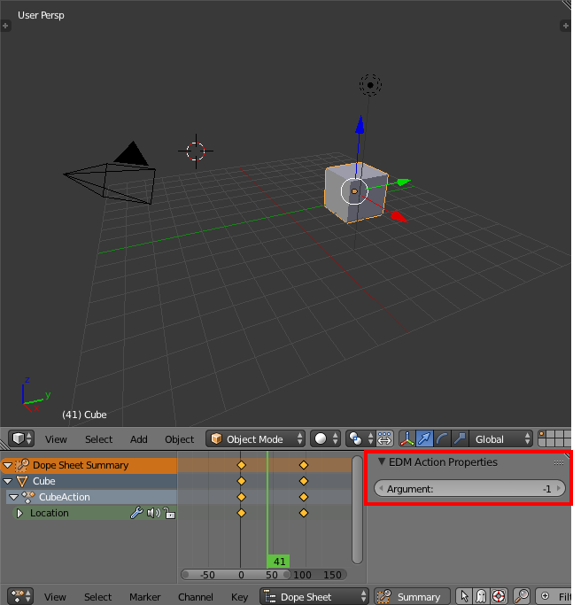
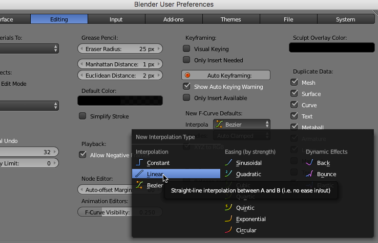

Animation
=========

In DCS Animations are controlled by a parameter called an *Argument*, a single
index number that indicates the embedded animation to control, and the value
of this animation is a number in the range ``-1.0`` to ``1.0``.

In Blender, individual groups of animations intended to be played at the same
time are contained in a group called an *Action*, which holds a set of
keyframe values associated with frame numbers. To map the animation concept to
those contained in the .edm file, each action can be associated with an
argument number, and the total length of the animation is scaled so that the
maximum frame becomes .edm animation frame 1.0, and the minimum becomes
``-1.0``. In cases where the Blender animation starts or stops at frame 0, the
corresponding limit becomes zero - so e.g. an animation running from frame 0
to frame 70 will be exported to run in the range ``0.0`` to ``1.0``.

Animation Argument
------------------

Once an action has been created, the argument value can be set from within
the Dope-Sheet, in the right properties panel.

It is currently not possible to set this directly from within the NLA editor,
a fact which may be changed in the future as the editor becomes more relevant
to edm modelling.

Interpolation
-------------

Blender supports a wide variety of keyframe-interpolation settings. EDM 
files only support one, linear interpolation. So to avoid the animations
looking different you must either change the interpolation for any new
animations to "Linear" interpolation (via the f-curve editor), or change
the settings so that all new animations are created with linear interpolation.

Changing the default can be achieved through the User Preferences, Editing tab:

