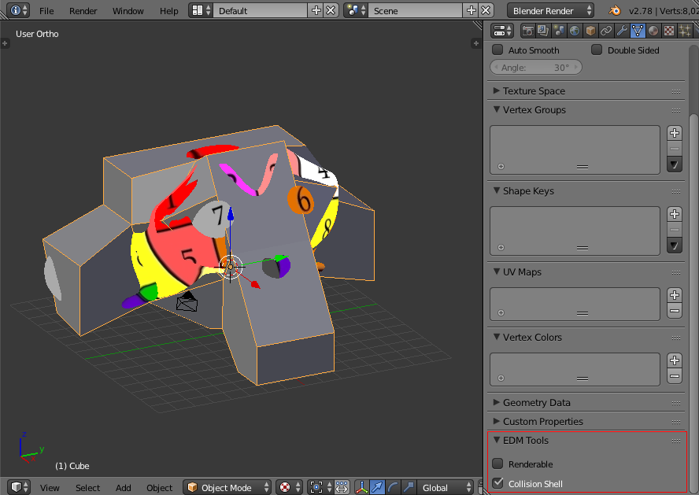

Collision Shells
================

Collision shells are geometry specifically used by the game for collision 
calculations, not rendering. This is useful because usually the model you want
to render is of a much higher detail than you need for pure collision
calculations, and so providing a separate (and usually lower resolution)
mesh for collisions allows these calculations to happen much faster.

In order to use a mesh object as a collision shell:

- Select the object
- Go the the 'Mesh data' properties panel
- Select the 'Collision Shell' option in the EDM Tools section

Note that it is currently unsupported in this exporter to have a single mesh
representing both a renderable mesh and a collision shell.

Model Viewer
------------

In order to preview the collision shell as read by the game, you can type
`showcol` into the text box along the bottom of the model viewer window.
Some versions of the viewer, usually those included directly with the game - 
do not support this mode. Use the externally provided viewer in these cases.