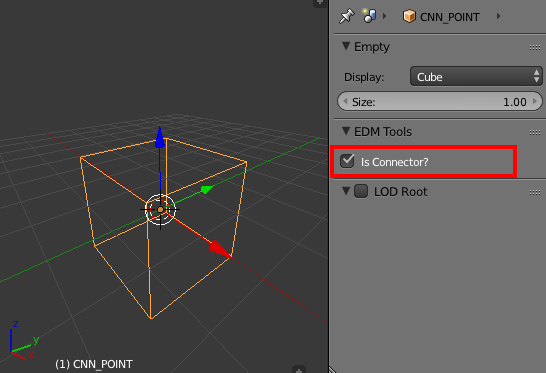

Connectors
==========

Connectors are used to designate positions in the model that are further used
in the DCS engine - for example: clickable cockpit interaction points, 
aircraft trail emission, pylon mounting positions, video display locations,
and anything else that required communication of a known position.

Only Empty objects can be connectors, and then can be set as a connector in
their data properties panel:

And the object name is used as the model connector name. It is recommended,
but not compulsory - that the 'Cube' type is used for Empty objects to be used
as connectors. This is because both 3DS and the model viewer use a cube to 
represent dummy objects (in 3DS) and the equivalent connectors (in DCS).

The connector size property is ignored when writing - however any size or
shape inherited via the connectors world transform is not ignored.